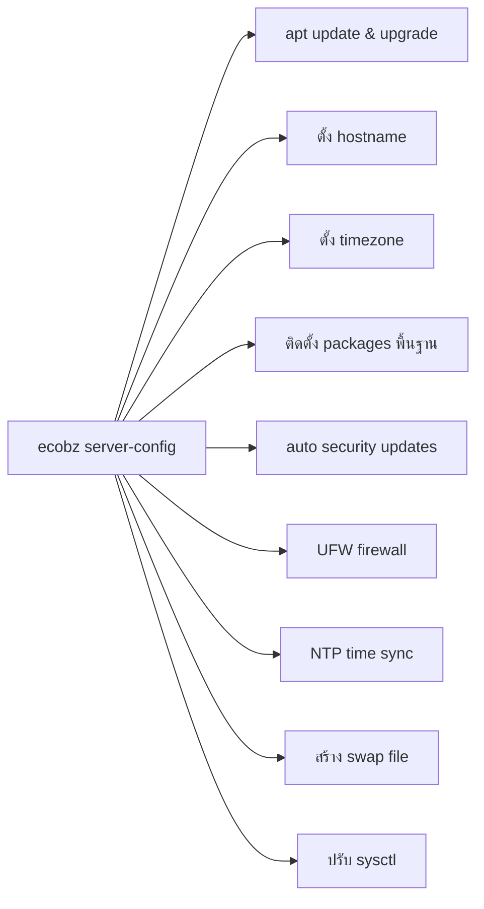

# ecobz — Ubuntu Server Auto-Config CLI

**หนึ่งคำสั่ง เซิร์ฟเวอร์พร้อมใช้งานทันที**

`ecobz` เป็น CLI tool สำหรับตั้งค่า Ubuntu Server แบบอัตโนมัติตามแนวทางแนะนำ (recommended) ใช้คำสั่งเดียวครบทุกขั้นตอน

## ความสามารถ (Features)



## วิธีติดตั้ง

```bash
git clone https://github.com/ManonWorkingArea/ecobz-script.git
cd ecobz-script
sudo make install
```

หรือ

```bash
sudo ./install.sh
```

## วิธีใช้งาน

### auto-configure ทั้งเซิร์ฟเวอร์ (แนะนำ)

```bash
sudo ecobz server-config
```

### ระบุ hostname และ timezone เอง

```bash
sudo ecobz server-config --hostname web01 --timezone Asia/Bangkok
```

### interactive mode (ถามทีละขั้นตอน)

```bash
sudo ecobz server-config --interactive
```

### minimal mode (ลงแค่ security essentials)

```bash
sudo ecobz server-config --minimal
```

### ปรับแต่งเพิ่มเติม

```bash
sudo ecobz server-config \
    --hostname my-server \
    --timezone Asia/Bangkok \
    --swap-size 4096 \
    --extra-pkgs nginx,docker.io,redis
```

## ตัวเลือกทั้งหมด

| Option                | คำอธิบาย                                |
| --------------------- | --------------------------------------- |
| `--interactive, -i`   | ถามก่อนทำแต่ละขั้นตอน                   |
| `--minimal`           | ลงแค่ security พื้นฐาน ข้าม monitoring tools |
| `--hostname <name>`   | ตั้งชื่อ server                         |
| `--timezone <tz>`     | ตั้ง timezone (default: `Asia/Bangkok`) |
| `--no-firewall`       | ข้ามการตั้งค่า UFW                      |
| `--no-auto-updates`   | ข้าม unattended-upgrades                |
| `--no-swap`           | ข้ามการสร้าง swap                       |
| `--swap-size <mb>`    | กำหนดขนาด swap (default: 2048MB)        |
| `--extra-pkgs <list>` | ติดตั้ง package เพิ่มเติม (คั่นด้วย ,)  |

## สิ่งที่ ecobz จัดการให้

1. **System Update** — `apt update && apt upgrade`
2. **Hostname** — ตั้ง hostname + อัปเดต `/etc/hosts`
3. **Timezone** — ตั้ง timezone ผ่าน `timedatectl`
4. **Essential Packages** — curl, wget, git, vim, htop, net-tools, jq, และอื่นๆ
5. **Security Updates** — ตั้งค่า `unattended-upgrades` ให้อัปเดตอัตโนมัติ
6. **Firewall** — ตั้ง UFW: default deny incoming, allow SSH
7. **NTP** — เปิด time sync ผ่าน `systemd-timesyncd` หรือ `chrony`
8. **Swap** — สร้าง swap file ถ้ายังไม่มี
9. **Locale** — ตั้ง `en_US.UTF-8`
10. **Sysctl** — ปรับค่า kernel ให้เหมาะกับ server
11. **MOTD Welcome** — หน้า login แสดง spec + คู่มือ monitor
12. **Logrotate** — หมุน log ป้องกัน disk เต็ม

## --minimal mode

`--minimal` จะข้าม monitoring tools (glances, sysstat, htop, iotop, iftop, ncdu, mtr, lm-sensors) 
เหลือแค่ security essentials + tools พื้นฐาน

```bash
sudo ecobz server-config --minimal
```

## Requirements

- Ubuntu 20.04 / 22.04 / 24.04 LTS
- Bash 4.0+
- ต้องรันด้วย `root` (sudo)

## License

MIT License
