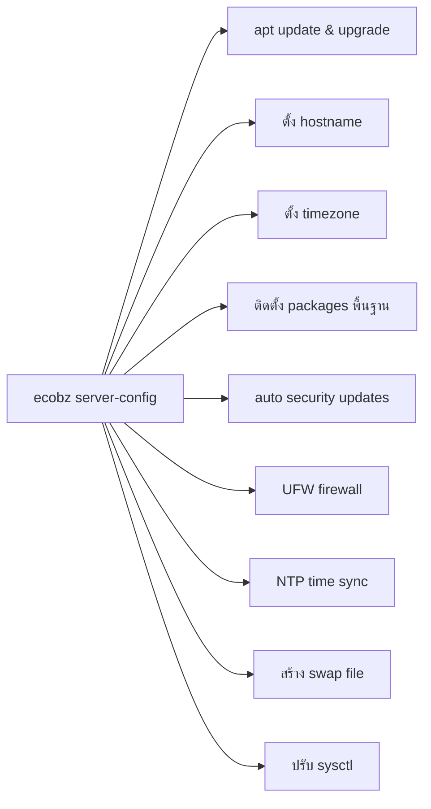

# ecobz — Ubuntu Server Auto-Config CLI

**หนึ่งคำสั่ง เซิร์ฟเวอร์พร้อมใช้งานทันที**

`ecobz` เป็น CLI tool สำหรับตั้งค่า Ubuntu Server แบบอัตโนมัติตามแนวทางแนะนำ (recommended) ใช้คำสั่งเดียวครบทุกขั้นตอน

## ความสามารถ (Features)



## วิธีติดตั้ง

### วิธีที่ 1: ติดตั้งจาก source (แนะนำ)

```bash
git clone https://github.com/ecobz/ecobz-script.git
cd ecobz-script
sudo make install
```

### วิธีที่ 2: curl | bash

```bash
curl -fsSL https://raw.githubusercontent.com/ecobz/ecobz-script/main/install.sh | sudo bash
```

### วิธีที่ 3: .deb package

```bash
# Build .deb
make deb

# Install
sudo dpkg -i ecobz_1.0.0_all.deb
```

## วิธีใช้งาน

### auto-configure ทั้งเซิร์ฟเวอร์ (แนะนำ)

```bash
sudo ecobz server-config
```

### ระบุ hostname และ timezone เอง

```bash
sudo ecobz server-config --hostname web01 --timezone Asia/Bangkok
```

### interactive mode (ถามทีละขั้นตอน)

```bash
sudo ecobz server-config --interactive
```

### ปรับแต่งเพิ่มเติม

```bash
sudo ecobz server-config \
    --hostname my-server \
    --timezone Asia/Bangkok \
    --swap-size 4096 \
    --extra-pkgs nginx,docker.io,redis
```

## ตัวเลือกทั้งหมด

| Option                | คำอธิบาย                                |
| --------------------- | --------------------------------------- |
| `--interactive, -i`   | ถามก่อนทำแต่ละขั้นตอน                   |
| `--hostname <name>`   | ตั้งชื่อ server                         |
| `--timezone <tz>`     | ตั้ง timezone (default: `Asia/Bangkok`) |
| `--no-firewall`       | ข้ามการตั้งค่า UFW                      |
| `--no-auto-updates`   | ข้าม unattended-upgrades                |
| `--no-swap`           | ข้ามการสร้าง swap                       |
| `--swap-size <mb>`    | กำหนดขนาด swap (default: 2048MB)        |
| `--extra-pkgs <list>` | ติดตั้ง package เพิ่มเติม (คั่นด้วย ,)  |

## สิ่งที่ ecobz จัดการให้

1. **System Update** — `apt update && apt upgrade`
2. **Hostname** — ตั้ง hostname + อัปเดต `/etc/hosts`
3. **Timezone** — ตั้ง timezone ผ่าน `timedatectl`
4. **Essential Packages** — curl, wget, git, vim, htop, net-tools, jq, และอื่นๆ
5. **Security Updates** — ตั้งค่า `unattended-upgrades` ให้อัปเดตอัตโนมัติ
6. **Firewall** — ตั้ง UFW: default deny incoming, allow SSH
7. **NTP** — เปิด time sync ผ่าน `systemd-timesyncd` หรือ `chrony`
8. **Swap** — สร้าง swap file ถ้ายังไม่มี
9. **Locale** — ตั้ง `en_US.UTF-8`
10. **Sysctl** — ปรับค่า kernel ให้เหมาะกับ server

## ขึ้น Ubuntu Repository (PPA)

ถ้าต้องการให้ติดตั้งผ่าน `apt install ecobz` โดยตรง:

### วิธีที่ 1: Launchpad PPA (ฟรี)

```bash
# 1. สร้าง PPA ที่ https://launchpad.net/
# 2. สร้าง source package และอัปโหลด
debuild -S -sa
dput ppa:yourusername/ecobz ecobz_1.0.0_source.changes

# 3. ผู้ใช้ติดตั้งด้วย
sudo add-apt-repository ppa:yourusername/ecobz
sudo apt update
sudo apt install ecobz
```

### วิธีที่ 2: Self-hosted APT repo

```bash
# บนเซิร์ฟเวอร์ของคุณ
mkdir -p /var/www/repo/ubuntu
cp ecobz_1.0.0_all.deb /var/www/repo/ubuntu/
cd /var/www/repo/ubuntu
dpkg-scanpackages . /dev/null | gzip -9c > Packages.gz

# ผู้ใช้เพิ่ม repo
echo "deb [trusted=yes] https://repo.yourdomain.com/ubuntu ./" | sudo tee /etc/apt/sources.list.d/ecobz.list
sudo apt update
sudo apt install ecobz
```

## Requirements

- Ubuntu 20.04 / 22.04 / 24.04 LTS
- Bash 4.0+
- ต้องรันด้วย `root` (sudo)

## License

MIT License
